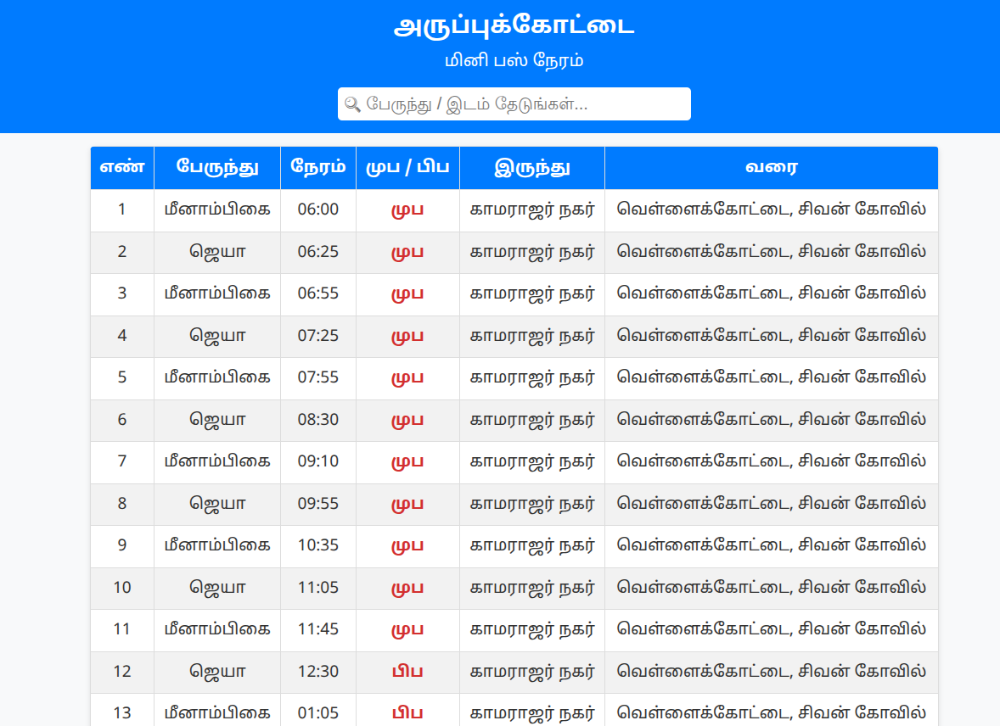

# 🚌 Minibus Timetable (Aruppukottai Region)

This project is a **bus timetable web application** built with **HTML, CSS, and JavaScript**.  
It allows users to quickly search and filter minibus schedules for routes around **Aruppukottai**.  

---

## 🚀 Features
- 📱 **Mobile-friendly UI** – Optimized for viewing on smartphones.  
- 🔎 **Search & Filter** – Quickly find buses by route name or time.  
- ⏰ **Timetable Highlighting** – AM (`முப`) and PM (`பிப`) times are highlighted for clarity.  
- 🖼️ Screenshot of homepage:



---

## 🌐 Live Demo
👉 [Click here to view the working site](https://moorthid2023.github.io/minibus/)  

---

## 🛠️ Tech Stack
- **HTML5** – Structure of the app  
- **CSS3** – Styling and responsive design  
- **JavaScript** – Filtering and dynamic search functionality  

---

## 📂 Project Setup
Clone the repository:
```bash
git clone https://github.com/moorthid2023/minibus.git
